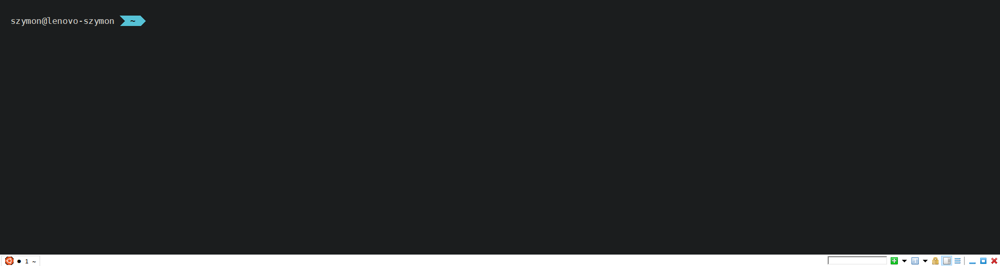
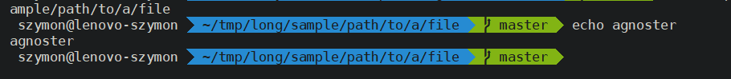

# Cmder-WSL-zsh

# Cmder config

## Requirements
- [Cmder](http://cmder.net) (for WSL mini version is enough),
- [DejaVu Sans Mono for powerline](https://github.com/powerline/fonts/blob/master/DejaVuSansMono/DejaVu%20Sans%20Mono%20for%20Powerline.ttf) font installed.
## Installation
1. Import `cmder-config.xml` in your cmder's settings,
2. Enjoy an easy to use, quake-style terminal configured to open WSL by default.
## Hotkeys
- `Ctrl`+`` ` `` toggles Cmder,
- `Ctrl`+`n` opens a zsh in WSL in a new tab,
- `Ctrl`+`N` opens cmder's cmd in a new tab,
- `Ctrl`+`Tab` switches between tabs,
- `Ctrl`+`|` divides the window vertically,
- `Ctrl`+`🡆` / `Ctrl`+`🡄` switches between consoles inside of current tab,
- `Ctrl`+`Shift`+`🡆` / `Ctrl`+`Shift`+`🡄` moves current tab's divider right / left,
- `Alt`+`Enter` toggles full screen,
- `Ctrl`+`d` / `Ctrl`+`w` closes current console.

# The agnoster-mod theme 
It's a modified original agnoster theme to make it look better in Cmder and even more readable.
## Requirements
- Zsh shell with [Oh-My-Zsh](https://github.com/robbyrussell/oh-my-zsh) installed.

### Optional but recommended
- [Zsh-dircolors-solarized](https://github.com/joel-porquet/zsh-dircolors-solarized) Oh-My-Zsh plugin to fix dir colors in `ls`.
## Installation
1. Copy `agnoster-mod.zsh-theme` into `~/.oh-my-zsh/themes` directory,
2. Change theme to agnoster-mod in your `.zshrc` file.
3. Relaunch zsh or use `source .zshrc` command to apply your changes.

## Differences to original agnoster
- A brighter dir path segment,
- An additional empty line before zsh's prompt,
- A dir path shortening.
## Comparison
### The agnoster-mod

### Original agnoster

